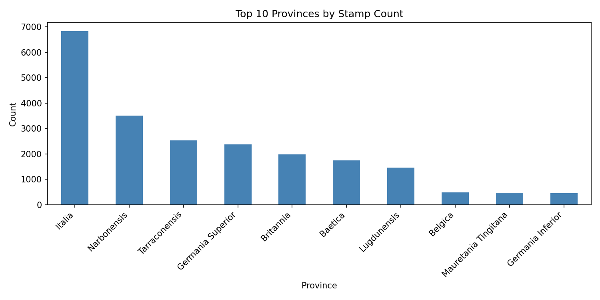
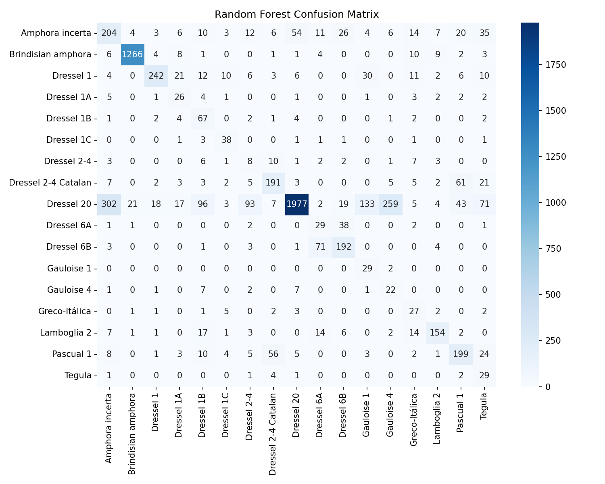
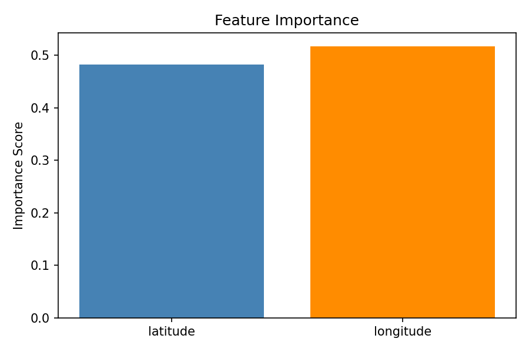

# Decoding the Roman Trade Network: What 24,000 Ancient Stamps Reveal

*Using machine learning and geographic data to uncover patterns in Roman commerce*

---

*Roman amphorae — the shipping containers of the ancient world. Image: Pixabay*

---

When archaeologists dig up a Roman amphora — one of those ancient clay jars that carried olive oil, wine, or fish sauce across the empire — they sometimes find a small stamp pressed into the clay. That stamp tells us where the jar was made, who made it, and what it carried.

Over decades of fieldwork, researchers have recorded more than **24,000 of these stamp finds** across the former Roman Empire — from Britannia in the north to Mauretania Tingitana in North Africa.

That raises an interesting question: **can we predict the stamp type just by knowing where it was discovered?**

---

## The Four Questions I Set Out to Answer

1. **Which Roman provinces have the most recorded stamp finds?**
2. **What are the most common amphora stamp types?**
3. **Can latitude and longitude alone predict the stamp type?**
4. **Which geographic axis — north/south or east/west — carries more predictive power?**

---

## The Data

The dataset comes from **CEIPAC** (Centre for the Study of Roman Amphoras) and contains 24,092 records. After cleaning — removing 45 rows with missing province values (0.19% of data) and filtering out stamp types with fewer than 100 records — I was left with **22,511 records** across **17 stamp types**.

---

## Q1: Which Provinces Had the Most Stamp Finds?

**Hypothesis:** Italia will dominate as the political and economic center of the empire.

| Province | Stamps Found |
|---|---|
| **Italia** | 6,832 |
| Narbonensis (S. France) | 3,498 |
| Tarraconensis (NE Spain) | 2,526 |
| Germania Superior | 2,365 |
| Britannia | 1,980 |

**Result ✅ Confirmed.** Italia leads by a wide margin. The presence of nearly 2,000 stamps in Britannia — a distant frontier province — confirms the extraordinary reach of Roman trade networks.

---

## Q2: What Were the Most Common Stamp Types?

**Hypothesis:** Oil-related types (Dressel 20) will dominate due to the scale of the Roman olive oil trade.

**Result ✅ Confirmed.** Dressel 20 dominates with **10,238 records** — more than double the second most common type. These amphorae carried Baetican olive oil from modern Andalusia, one of the most widely traded commodities in the ancient world.

---

## Q3: Can Geographic Coordinates Predict Stamp Type?

**Hypothesis:** Yes — each stamp type was produced in a specific region, so stamps should cluster geographically.

| Model | Accuracy |
|---|---|
| **Random Forest** | **69.6%** |
| Logistic Regression | 62.5% |
| Cross-Validation Mean (5-fold) | **71.8%** |

**Result ✅ Confirmed.** Nearly 70% accuracy from just two numbers is a strong result. Brindisian amphora hit **97% precision** — produced almost exclusively around Brindisi, its geographic signature is unmistakable.

---

## Q4: Latitude or Longitude — Which Matters More?

**Hypothesis:** Longitude will be more predictive, as major production zones differ more on an east-west axis.

| Feature | Importance |
|---|---|
| Longitude | 51.7% |
| Latitude | 48.3% |

**Result ✅ Confirmed — but barely.** Longitude edges ahead, but the near-equal split reveals that Roman trade was genuinely two-dimensional, leaving a spatial fingerprint in both directions.

---

## Conclusion

A model trained on nothing but geographic coordinates can predict which of 17 ancient stamp types was found at a site with nearly **70% accuracy**. Roman trade was structured, regional, and geographically consistent — and that structure is detectable two thousand years later.

Geography alone carries real signal. And sometimes, that is enough.

---

*Dataset: CEIPAC | Tools: Python, pandas, scikit-learn, matplotlib, seaborn*
*Author: Abdulrahman — Udacity Data Science Nanodegree*
